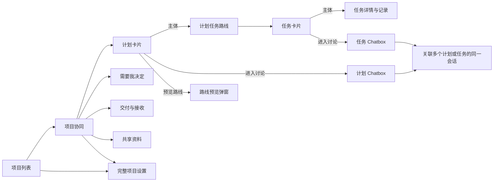

# 项目协同前端重构实施计划

编制日期：2026-10-08。状态：主体界面和 Chatbox 旧常驻入口已完成改造；[第三次复核](REVIEW3-20261008.md)的三处组合场景已完成[修复与验证](REMEDIATION3-20261008.md)，重开的 5 项关闭，progress.json 当前 44 项为 completed。该轮证据包含 58 项桌面、20 项当前镜像隔离业务及真实最小模型检查。用户随后明确授权重新构建并升级本地部署，[首次发布](LOCAL-RELEASE-20261008.md)为 Helm revision 14，职位偏好与按钮修正后的当前部署为 [revision 15](UI-CONSISTENCY-20261008.md)。历次复核和失败证据保留，通用多流程路由旧门槛另列。

[本次范围复核](REVIEW4-20261008.md)重新核对当前 418 个源码／契约、100 个发行资源和实际日志，并新跑 7 项关键恢复回归；均通过，未发现新的已复现阻断项。该结论限定于本轮已确认前端改造范围。

本地发布后，用户指出职位偏好弹窗挤窄及按钮密度不一致；已从组件自身布局与共享按钮规范修正，74 项桌面和 20 项真实镜像业务检查通过，本地升级到 revision 15，详见[界面一致性修正](UI-CONSISTENCY-20261008.md)。

目标：将正式 `web/` 改造成当前 [demo.html](../../../demo.html) 的对象入口流程，复用现有聊天、任务记录、审批、交接、设置、认证和真实 API。项目设置以现有正式前端的完整功能为基准。交互依据见 [项目协同与讨论入口重构方案](../../项目协同与讨论入口重构方案.md)，既有分叉规则见 [会话任务协作与分叉](../../会话任务协作与分叉.md)。

## 阅读与执行

| 文件 | 用途 |
| --- | --- |
| [01 页面、路由与数据契约](01-页面路由与数据契约.md) | 页面入口、范围、组件复用、查询与必要接口补充 |
| [02 实施任务清单](02-实施任务清单.md) | 八阶段、44 项任务、文件范围、依赖与阶段出口 |
| [03 测试、验收与交付](03-测试验收与交付.md) | 自动化场景、真实双用户／CLI／模型、视觉、隔离环境和完成标准 |
| [实施记录](IMPLEMENTATION.md) | 已实现结构、回归替换、证据及真实模型边界 |
| [progress.json](progress.json) | 任务状态、依赖、验收对应项与证据记录 |

本计划覆盖本轮导航与界面重构；[V1 计划](../v1/README.md) 继续规定产品、业务授权和运行边界。本轮新入口优先于旧文档中的“进入项目直接打开三栏聊天”“聊天侧栏常驻交接与跨计划分组”“头像位于左下角”等导航规则；已有业务状态、审批权限和固定来源规则继续生效。

## 已确认的产品方向

1. 项目列表展示项目卡片；进入项目先打开项目协同页。
2. 项目协同页提供“计划／需要我决定／交付与接收／共享资料”标签。
3. 计划卡片主体进入该计划的横向任务路线；卡片右下角进入计划主讨论；预览路线按钮打开同一张图的弹窗。
4. 任务卡片主体打开详情；右下角进入任务讨论。首次明确点击时按需创建独立任务主讨论，以后所有成员复用。
5. 上报进展、交付和问题本身不创建任务会话。AI 建议由人选择单独讨论、继续主讨论或关联已有讨论。
6. Chatbox 左侧显示当前计划或任务范围内的会话。同一会话关联多个计划／任务后在各范围可见，只有一个 ID 和历史；不增加独立“跨计划讨论”分组或分叉树。
7. 保留中央与右侧完整标签、拖拽、最大化、草稿、阅读位置、消息分叉和来源跳转。
8. 取消独立“待办概览”入口，执行工作由计划的“我负责”筛选和路线图本人任务提示承接。
9. 用户头像、名称和账户操作放到右上角；项目卡片提供邀请与设置按钮。取消单独个人设置导航，保留语言、主题、账户安全、退出及本人职位工作偏好。
10. 项目设置使用现有完整设置页，保留项目 AI、职位模板／分配／替换、成员邀请、流程编辑／模板／发布、职位工作偏好及 CLI／Skill 下载。
11. 正式与 demo 共用正式组件树；模拟用户、推送及 AI 输出只在明确 demo 模式出现。

## 规则与工程边界

- Project、Plan、Task、Position、Identity、Workflow、Topic、Report、Proposal、Handoff 和 Acceptance 保持既有领域职责。会话关联不改变任务的所属计划、分配、依赖、权限或交付贡献。
- 聊天、AI 摘要、建会话和接收交接不替代正式审批、任务验收或计划验收。安排草稿必须经过既有会签后生效。
- 主讨论关系由后端持久化；不能按标题或关联顺序猜测，也不能仅靠浏览器 storage 保证唯一。
- 实际工作在成员本地，平台记录、分析和建议；CLI 的正式决定沿用一次浏览器确认，读取同一结果。
- 页面范围和输入框任务上下文分别表达。同一公开会话的消息和草稿按 topicId 复用，正式事实和操作权限按当前对象重新查询。
- PostgreSQL 与对象存储仍是权威来源。demo 原型状态、私有提示词与未提交草稿不写入公开业务事实。
- 桌面端、中英文、深浅主题为正式验收范围。HeroUI 是唯一基础 UI 库，主题与布局值归统一 token，源文件不超过 2000 行。

架构变化主要是：项目级页面外壳、对象范围路由、按页面按需查询、持久化任务主讨论及查询投影。无需另建一套业务服务或替换现有流程引擎。具体接口和路由是本计划的工程默认，可在实施核对后细化；产品入口和上述规则不能因实现方便而回退。

## 编制时的源码核对

基准 HEAD：`e701073`，工作区有大量既有未提交改动。实施开始时必须重新记录状态与文件校验值，不把 HEAD 当作全部源码，也不覆盖、提交或清理无关改动。

| 已有基础 | 本轮处理 |
| --- | --- |
| `WorkspaceShell` 的真实项目列表、摘要、最近讨论、账户安全 | 保留，调整项目进入目的地和卡片操作，统一顶部账户 |
| `ChatWorkspace` 同树支持 api/demo，`WorkProvider` 分发数据源 | 将项目页面外壳提到聊天之上，继续共用业务组件与命令用例 |
| `Conversation`、`SidebarConversations`、标签、分栏与草稿 hooks | 改为对象范围入口；保留消息、分叉和视图状态能力 |
| `Plan.mainTopicId`、事务建立计划主讨论 | 直接复用；无来源计划空白主讨论，来源计划固定点分叉 |
| Topic 多对象 links、固定历史解析、分叉、任务活动、分析与讨论建议 | 复用；补范围分页、版本化关联编辑和跨对象正式事实装配 |
| Task 尚无持久化主讨论指针；当前“讨论任务”进入计划主讨论或让人选已有会话 | 新增后端按需 get-or-create，并改所有任务讨论入口 |
| Topic 关联接口当前为追加 links，未提供整组替换的预期关联版本 | 新增版本化替换用例；保护主讨论的必需关联 |
| `GET /me/actions` 已聚合提案、接收、任务和计划验收 | 复用并补查询契约核对；当前 handler 未使用 kind，必须实现筛选先于分页 |
| `apiStore` 当前先加载项目集合、各任务详情、流程版本和提案审阅，齐备后显示 | 按页面拆查询；卡片与普通成员入口不依赖管理数据或全量详情 |
| 完整 `SettingsScreen`、职位／流程模板、私人职位提示词、客户端下载 | 功能回归基线；不采用 demo 中简化设置弹窗作为替代 |

以上是源码核对，不是本轮运行验收。既有证据用于选回归场景；本轮完成状态只以本轮新证据为准。

## 实施阶段与出口

| 阶段 | 内容 | 完成出口 |
| --- | --- | --- |
| P0 | 基线、范围路由、固定视觉与契约 | 入口和规则可审查；已有改动已登记 |
| P1 | 必要 API、查询投影与主讨论事务 | 真实分页、并发、关联、待决查询经集成验证 |
| P2 | 共用外壳、项目卡片与右上角账户 | 项目列表进入协同；邀请／设置／认证入口可用 |
| P3 | 项目协同四类标签 | 真实计划、待决、交付接收和资料完整可达 |
| P4 | 计划路线、卡片、任务详情与预览 | 图与详情对应正式对象，入口分离，依赖保留 |
| P5 | 对象范围 Chatbox 与多对象讨论 | 按需主讨论、共享会话、分叉、标签和草稿闭环 |
| P6 | 完整设置、旧入口收口与文档 | 既有配置与授权功能无缺项，无重复正式组件树 |
| P7 | 自动化、真实隔离验收与交付 | 所有必需场景有证据；临时资源已清理 |

P0 → P1 → P2 → P3／P4 → P5 → P6 → P7。阶段间可交付小的真实垂直路径；此依赖图不要求或授权派发子代理。

## 工程默认与待核对项

采用现有 React Router 的路径路由作为规范入口；设置保持完整页面；资料为项目共享范围；任务详情从路线图弹窗或 Chatbox 右侧详情进入。项目历史／未关联讨论保留一个次要入口，避免旧话题无处访问；新项目可先登记计划草稿或先讨论形成计划。它们的细节见 01，属于本计划的工程默认。

既有 [职位多流程关联实测](../../职位多流程关联实测.md) 仍记录流程背景、严格节点判定与工具恢复等未关闭问题。此次界面不会把“进入某计划聊天”当作正式流程绑定。必需验收覆盖已定位任务的真实分析及明确失败状态；通用多流程自动路由的完整关闭需另列证据，不能由新 UI 验收推导。

当前没有必须阻止编制或开始实施的产品疑问。正式实施遇到影响既定业务规则的选择时先说明影响；一般文件拆分、参数命名和错误展示可依本计划处理。

## 本轮交付定义

交付正式代码、同树 api/demo 可运行预览、同步的 OpenAPI／类型／CLI 链接／设计文档、带场景和构建标识的证据及验收报告。上线现有部署为后续明确发布动作，不混入隔离验收。

实施时允许移除本轮替换的旧 UI 和过期视图状态，不为已废弃布局增加长期兼容层；保留业务记录、当前运行环境数据、用户未提交改动和可复用组件。草稿、阅读位置与现存消息链接按明确规则迁移；不能用全量 reset 掩盖问题。
