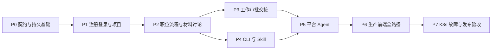

# Judex V1 完整业务开发计划

编制日期：2026-09-27。交付对象：下一位实施 AI／开发者。本文是**待实施计划**，不是实现完成声明。这里的 v1 是本次交付版本号，不是恢复 `docs/history/v1` 的旧产品规则。

目标：让真实内网用户完成注册登录、建立项目与岗位流程、协作讨论和正式决定、通过本地 AI＋CLI＋Skill 上报成果、交接验收，并在真实 PostgreSQL、对象存储、模型和 OpenSandbox 下闭环。正式前端唯一入口为 `web/`，不恢复 `docs/demo`。

## 阅读顺序与文档分工

| 文档 | 接手者必须得到的答案 |
| --- | --- |
| [00 范围、现状与决策](00-范围现状与决策.md) | 什么已确认、哪里只是工程方案、哪些旧内容不可沿用 |
| [01 架构、数据与事务](01-架构数据与事务.md) | 模块、迁移批次、表、约束、并发、幂等、后台任务 |
| [02 身份、项目与配置](02-身份项目与配置.md) | 注册登录、会话、项目邀请、稳定身份、提示词和流程发布 |
| [03 工作、审批与交接](03-工作审批与交接.md) | 谁能做什么、状态如何变化、超时／退回／换人如何处理 |
| [04 讨论、材料与事件](04-讨论材料与事件.md) | 提交包、文件版本、HTML 预览、实时同步与恢复 |
| [05 Agent 与沙箱](05-Agent与沙箱.md) | 真实模型、中心协调、轮次预算、工具、隔离和恢复 |
| [06 API 契约](06-API契约.md) | URL、请求响应、版本、错误、分页和契约生成要求 |
| [07 CLI 与 Skills](07-CLI与Skills.md) | 本地安装、认证、命令、人工确认、上报及宿主工具适配 |
| [08 前端联调与认证界面](08-前端联调与认证界面.md) | 页面状态、HeroUI、查询命令层、演示退出、真实登录与注册 |
| [09 分阶段任务清单](09-分阶段任务清单.md) | 按什么顺序改哪些文件、每一步的依赖和出口 |
| [10 测试与验收](10-测试与验收.md) | 真实双用户／CLI／AI／存储／故障／K8s 的验收场景 |
| [11 部署、发布与运维](11-部署发布与运维.md) | Helm、迁移、配置、备份恢复、发布制品与清理 |
| [12 交接执行规约](12-交接执行规约.md) | 如何推进计划、记录证据、处理阻塞，什么才算完成 |
| [progress.json](progress.json) | 机器可读的初始任务状态；初始均为 planned |

## 交付路线

每个阶段都交付前后端垂直路径，不等全部后端写完才首次联调。图中的 P6 是清除残余模拟与全路径收口，并非此前阶段不做前端。后台自动化依赖正式业务授权和事务，不能先让模型直接修改数据库。

## 接手后第一小时

1. 读根 `AGENTS.md`、本索引、00、01、06、09、12；再按当前阶段阅读专项文档。
2. 记录 `git status --short`、HEAD 和现有未提交改动。编制时 HEAD 为 `8edd258`，存在大量未提交前端工作，不能 reset 或覆盖它们。
3. 重读当前代码，不把本文的 2026-09-27 快照当成永远有效。若其他 AI 已实现某模块，验证并复用，记录差异，避免重复工程。
4. 检查 progress.json；选首个依赖满足的任务。没有证据的 completed 状态退回待验证，不按文字百分比推断完成。
5. 先建立 OpenAPI、错误和版本契约，再写具体 handler。修改契约时同步 Go、TS、CLI、测试与文档。

## 最终完成的硬条件

- 非 demo 的生产构建能注册、登录、恢复会话，两个独立用户在不同浏览器上下文协作；数据库持久化且重启后仍成立。
- 工作命令、审批、超时、交接、验收由服务器授权和事务决定；前端、CLI 和模型均不能自报 actor 或 `human_confirmed` 绕过。
- CLI／Skill 调用真实公共 API；至少一套实际本地 AI 工具完成获取事项 → 上报材料 → 平台讨论 → 人工决定 → 后续工作。
- 平台 AI 使用真实模型和真实沙箱；按项目轮次限制停止，缺料／失败／异议不会被当成通过。
- 项目共享文件持久化、隔离和版本可追溯，HTML 包能安全预览；私人提示词与执行上下文不进入共享目录。
- 生产关键路径无 501、假成功、seed 回退或演示身份切换。业务不可用时明确返回原因。
- [10](10-测试与验收.md) 的硬门槛有实际证据，部署配置、镜像／CLI／Skill 制品及恢复文档一同交付。

本计划不承诺未经实测的工期、容量或高可用等级；具体资源与恢复目标按 00 的环境决策处理，不能用“内网使用”免除认证、隔离与恢复验收。
